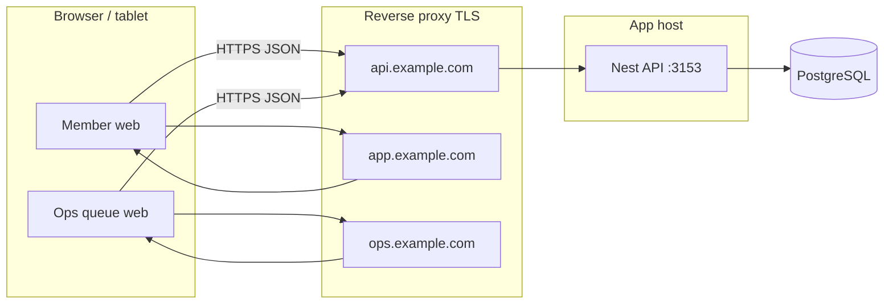

# Moja member platform — deployment guide

This document describes how to deploy **moja-member-app** to a production-like environment: the NestJS **member API**, PostgreSQL with **Prisma migrations**, the **member web app** (`client-web`), and optionally the **operations queue UI** (`ops-queue-web`). Use it as a runbook when you set up hosting later.

Related docs:

- [Rollout checklist](rollout-checklist.md) — flags and SSO shop rollout.
- [Shop ecosystem SSO plan](shop-ecosystem-sso-plan.md) — handoff JWT between member API and shop (`moja-sites`).
- [Voucher / rewards dashboard guide](voucher-rewards-dashboard-guide.md) — admin behaviour and member-facing catalog rules.
- Root [README](../README.md) — local dev, WhatsApp OTP, admin design notes.

---

## 1. What you are deploying

| Artifact | Technology | Default dev port | Production role |
|----------|------------|------------------|-----------------|
| **Member API** | NestJS + Prisma | `3153` (`PORT`) | REST API, auth, admin routes, embedded admin UI shell |
| **Member web** | Vite + React (`client-web`) | `5193` | PWA-style member UI; calls API via `VITE_API_BASE_URL` |
| **Ops queue web** | Vite + React (`ops-queue-web`) | `5194` | Kitchen / queue display; same API + `x-ops-api-key` |
| **Database** | PostgreSQL | — | Single DB; schema owned by Prisma migrations |

The API also serves **`GET /admin-dashboard`** (back-office HTML/JS from the repo). You do **not** need a separate admin static host unless you replace that with a standalone SPA later.

**Optional:** `mobile/` exists for React Native; this guide focuses on API + web clients. Deploy mobile through your usual app-store pipeline using the same public API base URL.

---

## 2. Prerequisites

1. **Node.js** — Use an LTS version compatible with Nest 11 and Vite 8 (for example **Node 22.x**). Match the version in CI and production.
2. **PostgreSQL** — Version supported by Prisma 5 (commonly 14+). Create a dedicated database and user with `CREATE`, `USAGE` on schema `public`, and rights to run migrations.
3. **TLS** — Terminate HTTPS at a reverse proxy (nginx, Caddy, cloud load balancer) in front of the API and static sites.
4. **Secrets** — Store `JWT_SECRET`, `ADMIN_API_KEYS` / admin JWT secrets, `OPS_QUEUE_API_KEY`, `DATABASE_URL`, and WhatsApp tokens in a secret manager or encrypted env, not in git.

---

## 3. High-level architecture



- **Cross-origin:** Member web and ops web are usually on **different origins** than the API. The API enables CORS from **`CLIENT_WEB_ORIGIN`** (comma-separated list). Every production origin that calls the API must appear there.
- **Build-time vs runtime:** Vite apps bake **`VITE_*`** into the JS bundle at **`npm run build`**. Changing the API URL in production requires a **rebuild** of `client-web` / `ops-queue-web` (or use a same-origin reverse-proxy pattern so the browser always calls `/api` on the same host).

---

## 4. Environment variables

### 4.1 API (repository root `.env`)

Copy **`.env.example`** to **`.env`** on the server (or inject equivalent keys from your platform). Critical variables:

| Variable | Purpose |
|----------|---------|
| `DATABASE_URL` | PostgreSQL connection string (Prisma). Use `sslmode=require` for managed cloud DBs when required. |
| `JWT_SECRET` | Signs member access tokens. Use a long random string; rotating it logs everyone out. |
| `JWT_EXPIRES_IN_SEC` | Member session length (default in example: 604800). |
| `PORT` | API listen port (default **3153**). Your reverse proxy forwards to this. |
| `CLIENT_WEB_ORIGIN` | **Comma-separated** browser origins allowed for CORS (member app + ops app + any other frontends). Example: `https://app.example.com,https://ops.example.com`. |
| `ADMIN_API_KEYS` | Comma-separated keys for legacy `x-admin-api-key` admin routes (if still used). |
| `ADMIN_JWT_SECRET` | Optional; defaults to `JWT_SECRET` if unset. Used for admin Bearer JWT. |
| `ADMIN_JWT_EXPIRES_IN_SEC` | Admin JWT lifetime. |
| `OPS_QUEUE_API_KEY` | Secret for `x-ops-api-key` on ops queue endpoints; ops UI stores or prompts for this. |
| `OTP_DELIVERY_MODE` | Production: typically **`whatsapp`** or **`auto`** with WhatsApp configured. **`mock`** is unsafe for real users. |
| `WHATSAPP_PROVIDER` | `meta` (default) or `twilio`. Selects which WhatsApp transport to use. |
| `WHATSAPP_ACCESS_TOKEN`, `WHATSAPP_PHONE_NUMBER_ID` | Required for real OTP via Meta WhatsApp Cloud API (`WHATSAPP_PROVIDER=meta`). |
| `TWILIO_ACCOUNT_SID`, `TWILIO_AUTH_TOKEN`, `TWILIO_WHATSAPP_FROM` or `TWILIO_MESSAGING_SERVICE_SID` | Required for real OTP via Twilio WhatsApp (`WHATSAPP_PROVIDER=twilio`). Add `TWILIO_WHATSAPP_CONTENT_SID` for production templates. |
| `FEATURE_SHOP_SSO`, `FEATURE_CAMPAIGN_ASYNC` | Feature flags; see [rollout-checklist.md](rollout-checklist.md). |
| `SHOP_WEB_BASE_URL`, `SHOP_HANDOFF_*` | Shop SSO handoff; see [shop-ecosystem-sso-plan.md](shop-ecosystem-sso-plan.md). |

Full list and comments: **`.env.example`** at repo root.

### 4.2 Member web (`client-web`)

| Variable | When |
|----------|------|
| `VITE_API_BASE_URL` | **Required for production builds.** Public base URL of the API, **no trailing slash** (e.g. `https://api.example.com`). Validated in `client-web/src/env.ts`. |
| `VITE_FEATURE_SHOP_SSO` | `true` only if shop SSO is enabled end-to-end. |
| `VITE_SHOP_WEB_URL` | Required in production when `VITE_FEATURE_SHOP_SSO` is `true`. |

Copy **`client-web/.env.production.example`** to **`client-web/.env.production`** and adjust values before `npm run build`.

### 4.3 Ops queue web (`ops-queue-web`)

| Variable | When |
|----------|------|
| `VITE_API_BASE_URL` | Same as member web: public API URL. |
| `VITE_OPS_API_KEY` | Optional dev convenience; in production operators usually paste the key in the UI (stored in `localStorage`). Avoid baking production secrets into the bundle unless you accept that risk. |
| `VITE_SHOP_TIMEZONE` | Optional; IANA zone for date filters (see `ops-queue-web/.env.example`). |

---

## 5. Database and migrations

1. Set **`DATABASE_URL`** on the machine that runs migrations (often the same host as the API or your CI deploy job).
2. From the **repository root**:

   ```bash
   npm ci
   npx prisma generate
   npx prisma migrate deploy
   ```

   - **`prisma migrate deploy`** applies all pending folders under `prisma/migrations/`. Safe for production (no prompts).
   - Use **`prisma migrate dev`** only on developer machines when authoring new migrations.

3. **Windows:** If `prisma generate` fails with a file rename **`EPERM`**, close processes locking `node_modules/.prisma` (editors, running Node), then retry. Running the terminal as Administrator is a last resort.

4. **Backups:** Schedule logical dumps (`pg_dump`) or your cloud provider’s automated backups before major upgrades. Test restore periodically.

---

## 6. Build and run the API

From **repository root**:

```bash
npm ci
npx prisma generate
npm run build
```

Production process:

```bash
node dist/main
```

Or use **PM2**, **systemd**, **Kubernetes**, or your cloud’s “Web App” service with:

- **Start command:** `node dist/main`
- **Working directory:** repo root (so relative paths like `data/` imports match dev expectations if used).
- **Environment:** inject full `.env` equivalent.

**Health checks:**

- `GET /health` → `{ "status": "ok" }`
- `GET /health/metrics` → counters snapshot (useful when debugging SSO / campaigns per [rollout-checklist.md](rollout-checklist.md))

Configure your load balancer or orchestrator to use **`/health`**.

---

## 7. Build and host static frontends

### 7.1 Member web (`client-web`)

```bash
cd client-web
npm ci
# Ensure .env.production exists with VITE_API_BASE_URL=...
npm run build
```

Output: **`client-web/dist/`**. Serve as static files (nginx `root`, S3 + CloudFront, Azure Static Web Apps, etc.). SPA routing: for client-side routes, fall back to **`index.html`**.

### 7.2 Ops queue web (`ops-queue-web`)

```bash
cd ops-queue-web
npm ci
# Set VITE_API_BASE_URL for production
npm run build
```

Output: **`ops-queue-web/dist/`**. Same static hosting pattern as member web.

### 7.3 Preview locally (smoke test)

```bash
npm run preview --prefix client-web
npm run preview --prefix ops-queue-web
```

Point previews at your staging API to verify CORS and auth before going live.

---

## 8. Reverse proxy and CORS checklist

1. **API public URL** — Example: `https://api.example.com` → proxy to `http://127.0.0.1:3153`.
2. **Member app origin** — Example: `https://app.example.com`.
3. **Ops app origin** — Example: `https://ops.example.com`.
4. Set **`CLIENT_WEB_ORIGIN`** to exactly those origins (scheme + host + port if non-default), comma-separated, no spaces unless trimmed (the app trims each segment).
5. Ensure the proxy forwards **`Authorization`**, **`x-admin-api-key`**, **`x-ops-api-key`**, and **`Content-Type`**; the API CORS `allowedHeaders` already lists these (see `src/main.ts`).
6. Prefer **HTTPS everywhere** so JWT and API keys are not sent in clear text.

---

## 9. First-time admin access

1. **`ADMIN_API_KEYS`** — Configure at least one key; use `x-admin-api-key` on admin HTTP calls or the embedded dashboard login flow if your deployment wires it that way.
2. **Admin JWT bootstrap** — When `admin_users` is empty, the API supports first-time bootstrap (see `.env.example` comment for `POST /admin/auth/bootstrap` with email/password). Restrict network access during bootstrap; disable or firewall unexpected callers.
3. **Admin dashboard** — Open `https://api.example.com/admin-dashboard` (or your mounted path if you strip prefix in nginx) after the API is up.

---

## 10. WhatsApp OTP (production)

1. Set **`OTP_DELIVERY_MODE`** to **`whatsapp`** (strict) or **`auto`** (WhatsApp when configured).
2. Pick a provider with **`WHATSAPP_PROVIDER`**:
   - **Meta**: set **`WHATSAPP_ACCESS_TOKEN`** and **`WHATSAPP_PHONE_NUMBER_ID`** per [README](../README.md) Meta setup. Use an **approved template** in production (`WHATSAPP_OTP_TEMPLATE_NAME` / `WHATSAPP_OTP_TEMPLATE_LANG`).
   - **Twilio**: set **`TWILIO_ACCOUNT_SID`**, **`TWILIO_AUTH_TOKEN`**, and either **`TWILIO_WHATSAPP_FROM`** (approved WhatsApp sender) or **`TWILIO_MESSAGING_SERVICE_SID`**. Use an **approved Content template** in production via **`TWILIO_WHATSAPP_CONTENT_SID`** (plain `Body` only works inside the 24h window or Sandbox).
3. Remove or avoid **`OTP_MOCK_FIXED_CODE`** in production.

---

## 11. Optional: shop SSO (`moja-sites`)

If members open the external shop with a signed handoff:

1. Align **`FEATURE_SHOP_SSO`**, **`SHOP_WEB_BASE_URL`**, **`SHOP_HANDOFF_ISSUER`**, **`SHOP_HANDOFF_AUDIENCE`**, **`SHOP_HANDOFF_JWT_SECRET`** (or default via `JWT_SECRET`) on the **member API**.
2. Configure the **shop** site with matching verification env vars (see `docs/shop-ecosystem-sso-plan.md` and the shop repo’s `shop-sso.env.example`).
3. Set **`VITE_FEATURE_SHOP_SSO`** and **`VITE_SHOP_WEB_URL`** on **client-web** builds.
4. Follow [rollout-checklist.md](rollout-checklist.md) for staged enablement.

---

## 12. Post-deploy verification

Run through these on **production URLs**:

| Step | Action |
|------|--------|
| 1 | `GET https://api.example.com/health` returns `ok`. |
| 2 | Member web loads with no console errors; OTP request/verify works (or expected error if WhatsApp misconfigured). |
| 3 | Sign in, open profile and perks; vouchers vs rewards match admin flags (`showInRewardsCatalog` and issued vouchers). |
| 4 | Ops UI: enter `x-ops-api-key` (or configured flow); queue endpoints respond. |
| 5 | Admin: open `/admin-dashboard`, authenticate, run a read-only action (e.g. overview). |
| 6 | If SSO enabled: handoff from member app to shop completes once per [rollout-checklist.md](rollout-checklist.md). |

---

## 13. CI/CD suggestions (you choose the platform)

This repo does not ship a Dockerfile or GitHub Actions workflow by default. A minimal pipeline:

1. **On merge to main:** `npm ci` at root → `npx prisma generate` → `npm run build` → run unit tests if you add them to gates.
2. **Deploy job:** `prisma migrate deploy` against prod `DATABASE_URL` → ship `dist/` + `node_modules` (or `npm ci --omit=dev` on server) → restart API process.
3. **Parallel jobs:** `npm run build --prefix client-web` and `npm run build --prefix ops-queue-web` with injected `VITE_*` → upload `dist/` artifacts to static hosting.

Cache `node_modules` and Prisma engines between builds to speed up CI.

---

## 14. Rollback

| Layer | Action |
|-------|--------|
| **API code** | Redeploy previous release artifact; restart process. |
| **Database** | Avoid downgrading migrations in place unless you have a tested down migration. Prefer **forward-fix** migrations. Restore from backup only for serious failure. |
| **Frontends** | Redeploy previous `dist/` build or revert CDN to prior version. |
| **Feature flags** | Set `FEATURE_SHOP_SSO=false`, `FEATURE_CAMPAIGN_ASYNC=false`, rebuild client if `VITE_FEATURE_SHOP_SSO` changes (see [rollout-checklist.md](rollout-checklist.md)). |

---

## 15. Security reminders

- Never commit **`.env`**, real **`ADMIN_API_KEYS`**, or **`OPS_QUEUE_API_KEY`**.
- Rotate API keys and JWT secrets on a schedule or after staff changes.
- Restrict **`/admin-dashboard`** and admin APIs by network (VPN, IP allow list) if possible.
- Keep PostgreSQL private to the API subnet; do not expose DB ports to the public internet.

---

## 16. Quick reference commands

```bash
# API — install, migrate, build, run
npm ci
npx prisma generate
npx prisma migrate deploy
npm run build
npm run start:prod

# Member web — production build
cd client-web && npm ci && npm run build

# Ops web — production build
cd ops-queue-web && npm ci && npm run build
```

Document the **exact** hostnames, key rotation dates, and migration versions applied in your internal runbook when you execute a real deployment.
